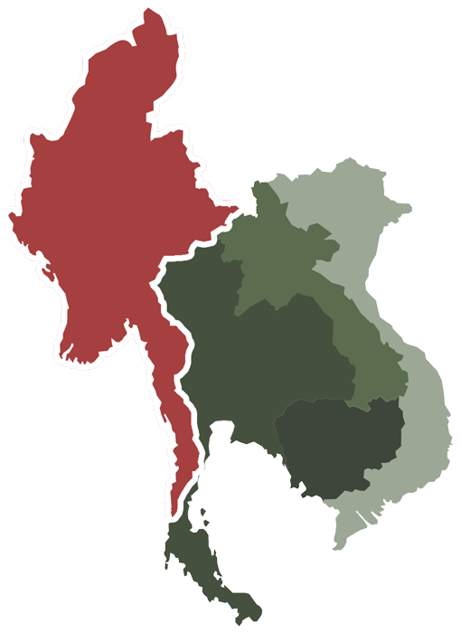

# Plotting Mekong Development Map

> In this project, I am using plotly to analysis and visualize data of Mekong region to improve and inform constructive dialogue and decision making for sustainable and equitable development.

## Visualization packages

### [Plotly](https://plotly.com/)
Plotly is a technical computing company that develops online data analytics and visualization tools. Plotly provides online graphing, analytics, and statistics tools for individuals and collaboration, as well as scientific graphing libraries for Python, R, MATLAB, Perl, Julia, Arduino, and REST.

### [plotly.py](https://plotly.com/python/)
An interactive, open-source, and browser-based graphing library for Python.

>Plotly Express is a new high-level Python visualization library: it's a wrapper for Plotly.py that exposes a simple syntax for complex charts.

### [GeoJSON](https://geojson.org/)
An open standard format designed for representing simple geographical features, along with their non-spatial attributes.

## Data
### [OpenDevelopmentMekong](https://opendevelopmentmekong.net//)
Open Development Mekong (OD Mekong) and related country websites are independent collectors and providers of objective data on development trends in the Mekong Delta.

## References

- https://un-mapped.carto.com/tables/states_india/public/map

- https://plotly.com/python/choropleth-maps/

- https://plotly.com/python/colorscales/

- https://plotly.com/python/bubble-maps/

- https://plotly.com/python/mapbox-layers/